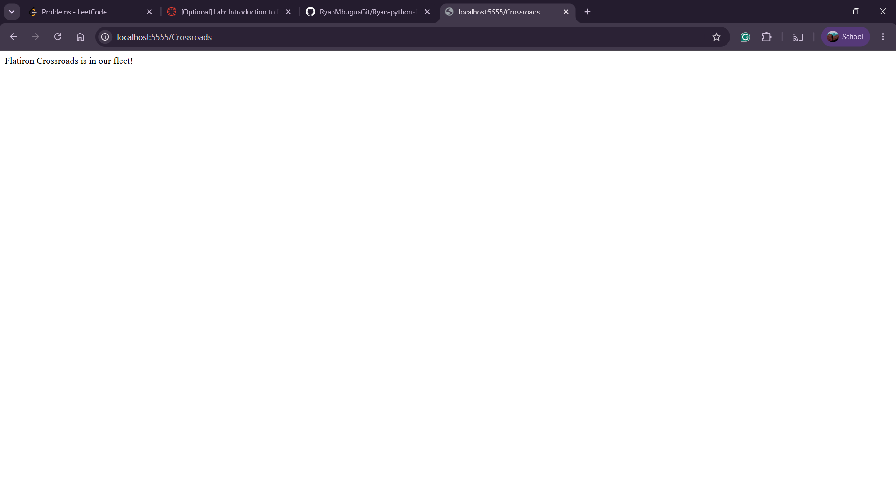

# Flatiron Cars - Flask Routes Lab

A simple Flask API built for a car company. This app provides two routes: a default welcome route and a route to check whether a specific car model is part of the company's fleet.

## Description

This project is a lab exercise in building basic Flask routes. It uses a hardcoded list of car models (`existing_models`) to simulate a small car company database, and exposes two endpoints to interact with that data.

## Routes

- **`GET /`**
  Returns a welcome message.
  Response: `Welcome to Flatiron Cars`

- **`GET /<model>`**
  Checks whether the given car model exists in the company's fleet.
  - If the model is found: `Flatiron {model} is in our fleet!`
  - If the model is not found: `No models called {model} exists in our catalog`

## Tech Stack

- Python
- Flask
- Pipenv (for dependency and virtual environment management)
- Pytest (for testing)

## Setup

1. Clone the repository:
```bash
   git clone <repo-url>
   cd Ryan-python-flask-car-routes-lab
```

2. Install dependencies:
```bash
   pipenv install
   pipenv shell
```

3. Navigate to the server folder and run the app:
```bash
   cd server
   python app.py
```

4. Visit `http://localhost:5555/` in your browser.

## Testing

Run the test suite from the `server` folder:

```bash
python -m pytest testing/ -v
```

All 5 tests should pass, covering:
- The `/` route status code and response text
- The `/<model>` route status code
- The response text for a model that exists in the fleet
- The response text for a model that does not exist in the fleet

## Demo



*Example: visiting `/Crossroads` returns "Flatiron Crossroads is in our fleet!"*